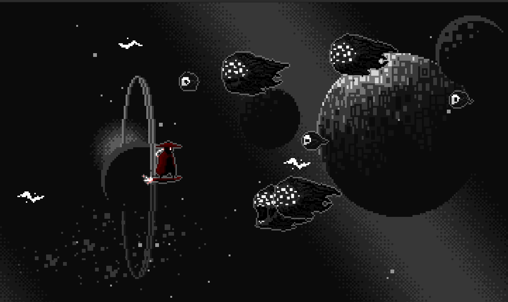

# Epitech - R-Type AECS documentation

This document desribe how the AECS game engine works.

## Introduction

AECS is a game engine made for the R-Type project at Epitech, based on the ECS principle: Entity-Component-System.

# What is an ECS?

An ECS is a game engine architecture that is based on the composition principle:
instead of having a class for each entity, you have a class for each component, and you can add as many components as you want to an entity.

An entity is simply an ID, that is used to uniquely identify a game object - whether it is a player, a bullet, an enemy, the player's score, etc.

A component is simply a class/structure that contains data, and those components can be attached to entities to form a game object.

A system is a class that contains logic, and can be applied to entities that have the required components.

For example, if we have this game:



We could have an entity for the player, for the background, for the enemies, and for each bullet.

- The player entity could have a `Player` component, a `Position` component, a `Velocity` component, and a `Sprite` component.
- The background entity could have a `Position` component, a `Velocity` component, and a `Sprite` component.
- The enemies entity could have a `Position` component, a `Velocity` component, a `Sprite` component, and a `Health` component.
- The bullets entity could have a `Position` component, a `Velocity` component, a `Sprite` component, and a `Damage` component.

We could then have the following systems:

- A `PlayerSystem` that would handle the player's input, and update the player's position and velocity.
- A `PhysicsSystem` that would update the position of every entity that has a `Position` and a `Velocity` component.
- A `SpriteSystem` that would render every entity that has a `Sprite` component.
- A `CollisionSystem` that would handle collisions between entities that have a `Position` component and a `Health` component.

# How does AECS work?

AECS is a C++ game engine that is based on the ECS principle.

## Creating a world

Before doing anything, you have to create a `World` object, that will contain all the entities, components, and systems.

```c++
aecs::World world;
```

## Registering systems

You will then need to register all the systems that you want to use in your game. Each system must inherit from
`aecs::ISystem`, and their constructor **_MUST_** take as their 2 first parameters a `aecs::World&` and a
`std::vector<std::shared_ptr<Entity>>`. This vector contains all the entities; It is then the system's job to filter the entities it needs.

Also, when you create/destroy/modify an entity, the `onEntityAdded`/`onEntityRemoved`/`onEntityModified` methods of
every system are called respectively, with the entity as parameter. It is then the system's job to filter the entities.

An entity is considered modified when a component is added/removed to it.

> **_NOTE_** As implementing the `onEntityAdded`/`onEntityRemoved`/`onEntityModified` methods is almost always the same,
  you can derive your system from 'aecs::AbstractSystem' instead of 'aecs::ISystem', which already implements those
  methods, by only selecting the entities that have the components you need(passed as parameters to the constructor of `aecs::AbstractSystem`).

```c++
world.registerSystem<PhysicsSystem>(priority, /* Additional params to pass to ctor */);
world.setSystemPriority<PhysicsSystem>(priority); // If necessary
```

> **_NOTE_** The priority is used to determine the order in which the systems are updated. The lower the priority, the earlier the system is updated.

## Registering a RenderSystem

AECS distinguishes between a `RenderSystem` and a `LogicSystem`. While the latter is responsible for the game logic, the former is responsible for rendering the game.

As such, you can only have one `RenderSystem` per `World`.

```c++
world.registerRenderSystem<RenderSystem>(/* Additional params to pass to ctor */);
```

## Creating entities

You can create an entity by calling `createEntity` on the `World` object. This will return a `aecs::Entity &`.

```c++
aecs::Entity &player = world.createEntity();
```

You can then attach components to the entity by calling `addComponent` on the entity.

```c++
player.addComponent<Player>();
player.addComponent<Position>(0, 0);
player.addComponent<Velocity>(0, 0);
player.addComponent<Sprite>("player.png");
// ...
```

> **_NOTE_** Components must be classes inheriting from `aecs::AbstractComponent`.

## Running the game

That's it ! Now that you have entities, components, and systems, you can run the game by calling `update` on the `World`
to update the logic, and `render` to render the game.

```c++
while (_renderSystem->isOpen()) {
    world.update();
    world.render();
}
```

> **_NOTE_** This is a voluntary design choice to call `update` and `render` on the `World` object directly, instead of
  having a `run` method on the `World` object. This is because one may want to update the logic and render the game at
  different rates, or performing other actions between the update and the render.

That's it ! You now have a working game engine ! For a more complete example, you can check the full documentation,
available [here](), as this example is a voluntary simplified version of the engine.
