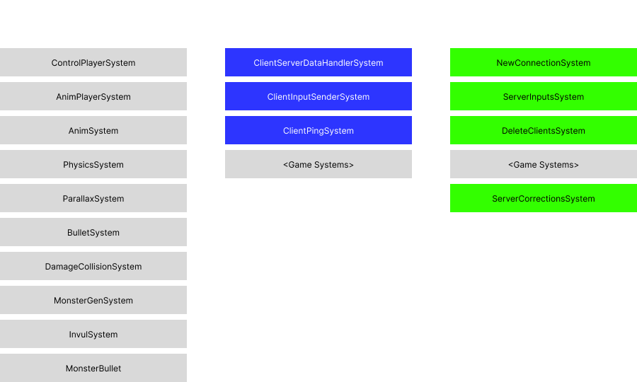

# Epitech - R-Type Developer Documentation

This documentation is made to help you understand how the R-Type project works.

As a refresher, r-type is a multiplayer game, based on the AECS game engine, where players control a spaceship,
and have to destroy enemies and bosses. It is as such a networked game, where the server is authoritative, and the clients are dumb.

As such, we need to have well-defined Systems, Components, and Entities, as well as a well-defined network protocol.

Per chance, we have a well-defined network protocol, as it is part of the AECS game engine, and we will use it as such.

# The game engine

As for the game engine itself (the part executed both on the server, and on the client as a prediction), it is divided
in several systems, which are executed in this order:

- `ControlPlayerSystem`: Handles the player's input, and updates the player's velocity.
- `AnimPlayerSystem`: Handles the player's animation, and updates the player's sprite.
- `AnimSystem`: Handles the animation of every entity that has a `Sprite` component.
- `PhysicsSystem`: Updates the position of every entity that has a `Position` and a `Velocity` component.
- `ParallaxSystem`: Updates the position of every entity that has a `Position` and a `Parallax` component.
- `BulletSystem`: Updates the position of every entity that has a `Position` and a `Bullet` component.
- `DamageCollisionSystem`: Handles collisions between entities that have a `Position` and a `Damage` component.
- `MonsterGenSystem`: Handles the generation of monsters.
- `InvulSystem`: Handles the invulnerability of every entity that has a `Position` and a `Invul` component.
- `MonsterBullet`: Handles the generation of bullets by monsters.

This game logic runs at 128 ticks per second on both the server and the client.

# The network protocol

## Client side

The client needs to perform 3 networked actions:

- Send its inputs to the server
- Receive the game state/changes from the server
- Send a ping to the server

These 3 actions are performed in 3 different systems, executed before the game systems, in this order:

- `ClientServerDataHandlerSystem`: Handles the connection to the server, and the reception of the game state (upon connection), and the game changes.
- `ClientInputSenderSystem`: Handles the sending of the client's inputs to the server.
- `ClientPingSystem`: Handles the sending of the client's ping to the server.

## Server side

The server needs to perform 3 networked actions:

- Handle new connections
- Receive the client's inputs
- Send the game state/changes to the client

In addition, it needs to disconnect client that have not sent any data for more than 5 seconds.

These 4 actions are performed in 4 different systems, executed before or after the game systems, in this order:

- `NewConnectionSystem`: Handles the new connections, by creating a new `Player` entity for each new connection.
- `ServerInputsSystem`: Handles the reception of the client's inputs, and passes it to the game systems
- `DeleteClientSystem`: Handles the disconnection of clients that have not sent any data for more than 5 seconds.
- `<Game systems>`
- `ServerCorrectionsSystem`: Handles the sending of the game changes to clients.

In addition, a `PlayerOnConnectionSystem` checks when a new player connects, and attaches every component that is required to the player's entity.

# Diagram

